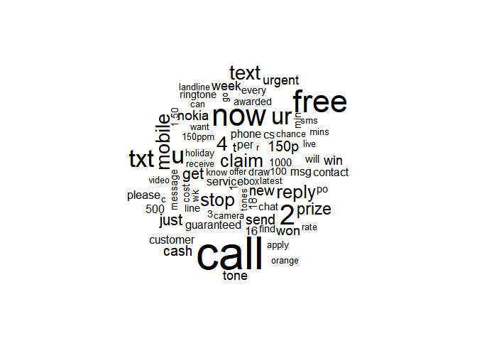
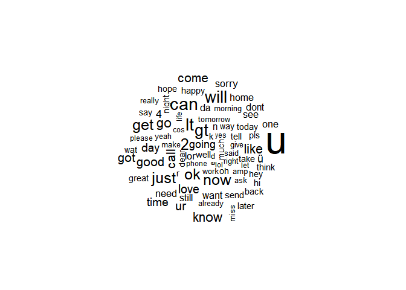

# Probability and Statistics

# Lab Assignment 1: Naive Bayes Classifier

### *Volodymyr Kuzma, Anton Mazuryk, Oleksii Mytnyk*

## Introduction

**Naive Bayes classifier** is a probabilistic classifier whose aim is to
determine which class some observation probably belongs to by using the
Bayes formula:
$$\mathsf{P}(\mathrm{class}\mid \mathrm{observation})=\frac{\mathsf{P}(\mathrm{observation}\mid\mathrm{class})\mathsf{P}(\mathrm{class})}{\mathsf{P}(\mathrm{observation})}$$

Under the strong independence assumption, one can calculate
P(observation∣class) as
$$\mathsf{P}(\mathrm{observation}) = \prod\_{i=1}^{n} \mathsf{P}(\mathrm{feature}\_i), \qquad \mathsf{P}(\mathrm{observation} \mid \mathrm{class}) = \prod\_{i=1}^{n} \mathsf{P}(\mathrm{feature}\_i \mid \mathrm{class}),$$
where *n* is the total number of features describing a given
observation. Thus, P(class\|observation) now can be calculated as

$$\mathsf{P}(\mathrm{class} \mid \mathrm{\mathrm{observation}}) = \mathsf{P}(\mathrm{class})\times \prod\_{i=1}^{n}\frac{\mathsf{P}(\mathrm{feature}\_i\mid \mathrm{class})}{\mathsf{P}(\mathrm{feature}\_i)}$$
Hence,
$$\mathsf{P}(\mathrm{spam} \mid \mathrm{message})=\mathsf{P}(spam)\times\prod\_{i=1}^{n}\frac{\mathsf{P}(\mathrm{word}\_i\mid \mathrm{spam})}{\mathsf{P}(\mathrm{word}\_i)},\\ \mathsf{P}(\mathrm{spam})=\frac{\mathrm{M}\_s}{\mathrm{M}}$$

$$
\mathsf{P}(\mathrm{word}\_i)=\frac{\mathrm{W}\_{\mathrm{word}\_i}}{\mathrm{W}},
\mathsf{P}(\mathrm{word}\_i\mid \mathrm{spam})=\frac{\mathrm{S}\_{\mathrm{word}\_i}}{\mathrm{S}}
$$

Since, for ham *M* and P(word<sub>*i*</sub>) are the same, we should
compare

M<sub>*s*</sub>×

**Necessary libraries**

``` r
library(tidytext)
library(readr)
library(dplyr)
```

    ## 
    ## Attaching package: 'dplyr'

    ## The following objects are masked from 'package:stats':
    ## 
    ##     filter, lag

    ## The following objects are masked from 'package:base':
    ## 
    ##     intersect, setdiff, setequal, union

``` r
library(ggplot2)
library(wordcloud)
```

    ## Loading required package: RColorBrewer

### Data pre-processing

``` r
list.files(getwd()) # Should print "bayes_classifier.Rmd" "data" "README.md"
```

    ## [1] "bayes_classifier.md"    "bayes_classifier.Rmd"   "bayes_classifier_files"
    ## [4] "data"                   "README.md"

``` r
list.files("data")  # Should print "stop_words.txt" "test.csv" "train.csv" 
```

    ## [1] "stop_words.txt" "test.csv"       "train.csv"

``` r
test_path <- "data/test.csv"
train_path <- "data/train.csv"

stop_words <- strsplit(read_file("data/stop_words.txt"), split='\n')[[1]]
```

#### Fetching data from csv

``` r
train <- read.csv(file = train_path, stringsAsFactors = FALSE)
test  <- read.csv(file = test_path,  stringsAsFactors = FALSE)
```

#### Filtering

``` r
tidy_text <- train %>% mutate(ID = row_number()) %>% unnest_tokens('Word', 'Message', token="words") %>% filter(!Word %in% stop_words)
```

#### **Final train data**

``` r
X_train <- tidy_text %>% select(Word, ID)
Y_train <- (tidy_text$Category == "spam") %>% ifelse(1, 0)
```

## Data visualization

**Common spam words:**

``` r
count_df <- tidy_text %>% filter(Category == "spam") %>% count(Word)
wordcloud(words = count_df$Word, freq = count_df$n, max.words = 80)
```



**Common ham words:**

``` r
count_df <- tidy_text %>% filter(Category == "ham") %>% count(Word)
wordcloud(words = count_df$Word, freq = count_df$n, max.words = 80)
```



## Classifier implementation

``` r
naiveBayes <- setRefClass("naiveBayes",
  fields = list(
    spam_messages_cnt="number",
    ham_messages_cnt="number",
    spam_words_cnt="number",
    ham_words_cnt="number",
    words="data.frame"
    ),
  methods = list(
    fit = function(X, y)
    {
      df <- data.frame(X, y)
      spam_messages_cnt <<- sum((df[!duplicated(df$ID), ])$y == 1)
      ham_messages_cnt <<- sum((df[!duplicated(df$ID), ])$y == 0)
      words <<- df %>% group_by(Word) %>% transmute(
        Ham = sum(1 - y), Spam = sum(y))
      words <<- words[!duplicated(words$Word), ]
      spam_words_cnt <<- sum(words$Spam)
      ham_words_cnt <<- sum(words$Ham)
    },
    
    predict = function(message)
    {
      message <- tibble('Message' = message) %>%
                  unnest_tokens('Word', 'Message', token="words") %>%
                  filter(!Word %in% stop_words) %>%
                  merge(words, by = "Word", all.x = TRUE)
      message[is.na(message)] = 0
      
      probability <- message %>% transmute(
        pspam = (Spam + 1) / (nrow(words) + spam_words_cnt),
        pham = (Ham + 1) / (nrow(words) + ham_words_cnt))
      
      return (prod(probability$pspam) * spam_messages_cnt >
              prod(probability$pham) * ham_messages_cnt)
    },
    
    score = function(X_test, y_test)
    {
      data <- data.frame(
        X_test %>% group_by(Message) %>% transmute(Predicted=predict(Message)),
        y_test %>% transmute(Actual = ifelse(Category == "spam", TRUE, FALSE)))
      
      return (sum(data %>% transmute(
        diff = ifelse(Predicted == Actual, 1, 0))) / nrow(X_test))
    }
))

model = naiveBayes()
model$fit(X_train, Y_train)
model$score(test["Message"], test["Category"])
```

    ## [1] 0.9789644

## Measure effectiveness of your classifier

-   Note that accuracy is not always a good metric for your classifier.
    Look at precision and recall curves, F1 score metric.
-   Visualize them.
-   Show failure cases.

## Conclusions

Summarize your work by explaining in a few sentences the points listed
below.

-   Describe the method implemented in general. Show what are
    mathematical foundations you are basing your solution on.
-   List pros and cons of the method. This should include the
    limitations of your method, all the assumption you make about the
    nature of your data etc.
